# Порівняльний SCA-аналіз npm-пакетів `jsonwebtoken` і `jose`

## 1. Мета роботи

Мета роботи - порівняти два npm-пакети, які використовуються для близьких задач у сфері JWT, JOSE та токенів автентифікації. Для аналізу обрано не найновіші версії, а такі, що мають реальну історію вразливостей:

- `jsonwebtoken@8.5.1`;
- `jose@4.15.4`.

Порівняння виконано з позиції аналізу складу програмного забезпечення (SCA, Software Composition Analysis): кількість залежностей, наявні CVE, CVSS, EPSS, результати Socket.dev, deps.dev, OpenSSF Scorecard, Syft SBOM і сканування через Grype.

---

## 2. Обґрунтування вибору пакетів

Ця пара є вдалою для порівняння, тому що обидва пакети пов'язані з JWT/JOSE-екосистемою, але мають різний профіль ризику.

`jsonwebtoken@8.5.1` - популярна стара версія пакета для роботи з JWT. Вона має кілька відомих повідомлень про вразливості, складніше дерево залежностей і потребує оновлення до версії `9.0.0` для усунення знайдених проблем.

`jose@4.15.4` - сучасніша бібліотека для JOSE/JWT/JWK/JWS/JWE-сценаріїв. У цій версії також є вразливість, але пакет має нуль зовнішніх npm-залежностей, кращий бал OpenSSF Scorecard і меншу поверхню ризику через залежності. Саме тому порівняння не зводиться до простого підрахунку CVE: потрібно одночасно дивитися на залежності, якість підтримки, критичність вразливостей і ймовірність їх експлуатації.

Використані сторінки пакетів:

- [npm: jsonwebtoken 8.5.1](https://www.npmjs.com/package/jsonwebtoken/v/8.5.1)
- [npm: jose 4.15.4](https://www.npmjs.com/package/jose/v/4.15.4)

---

## 3. Методика аналізу

Для кожного пакета були використані такі джерела й інструменти:

- npm Registry - перевірка версії, ліцензії, кількості залежностей і базової інформації про пакет;
- Socket.dev - попередня оцінка ризиків пакета;
- deps.dev - граф і структура залежностей;
- OpenSSF Scorecard - оцінка безпекової гігієни репозиторію;
- Syft - створення SBOM у форматі CycloneDX JSON;
- Grype - сканування SBOM на відомі вразливості;
- NVD - ручна перевірка CVE та CVSS;
- EPSS API FIRST - оцінка ймовірності експлуатації CVE.

Ручну CVE-перевірку я робив через NVD, бо там на одній сторінці доступні опис вразливості, CVSS і посилання на першоджерела.

Для середньої CVSS у порівняльній таблиці використано оцінки NVD CVSS v3.1, оскільки саме NVD-сторінки були перевірені вручну. Grype використано як інструментальне підтвердження того, що відповідні повідомлення про вразливості знаходяться у SBOM.

---

## 4. Результати аналізу

### 4.1 npm і структура залежностей

На сторінці npm для `jsonwebtoken@8.5.1` видно, що пакет має ліцензію MIT і 10 прямих залежностей. Локальний `npm ls --all` показав 10 прямих залежностей і 4 унікальні транзитивні залежності. Тобто використання цього пакета додає до проєкту не лише сам `jsonwebtoken`, а й низку додаткових компонентів.

Для `jose@4.15.4` npm-сторінка показує ліцензію MIT і 0 залежностей. Локальний `npm ls --all` підтвердив, що пакет встановлюється без зовнішнього дерева npm-залежностей.

```text
jsonwebtoken@8.5.1
├── jws@3.2.3
├── lodash.includes@4.3.0
├── lodash.isboolean@3.0.3
├── lodash.isinteger@4.0.4
├── lodash.isnumber@3.0.3
├── lodash.isplainobject@4.0.6
├── lodash.isstring@4.0.1
├── lodash.once@4.1.1
├── ms@2.1.3
└── semver@5.7.2
```

```text
jose@4.15.4
└── без зовнішніх npm-залежностей
```

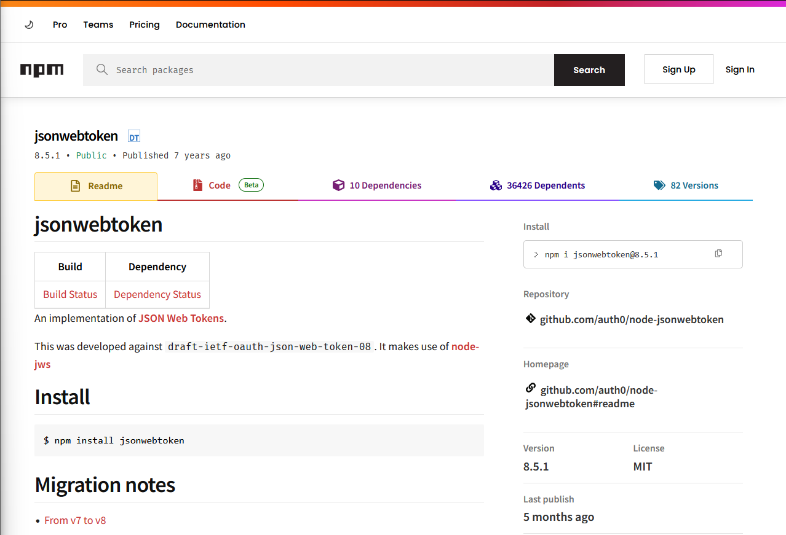

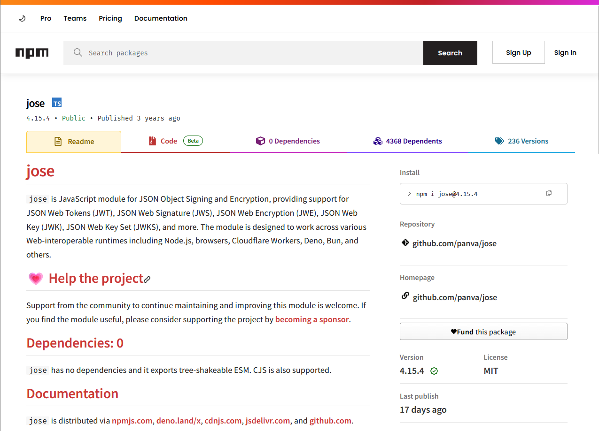

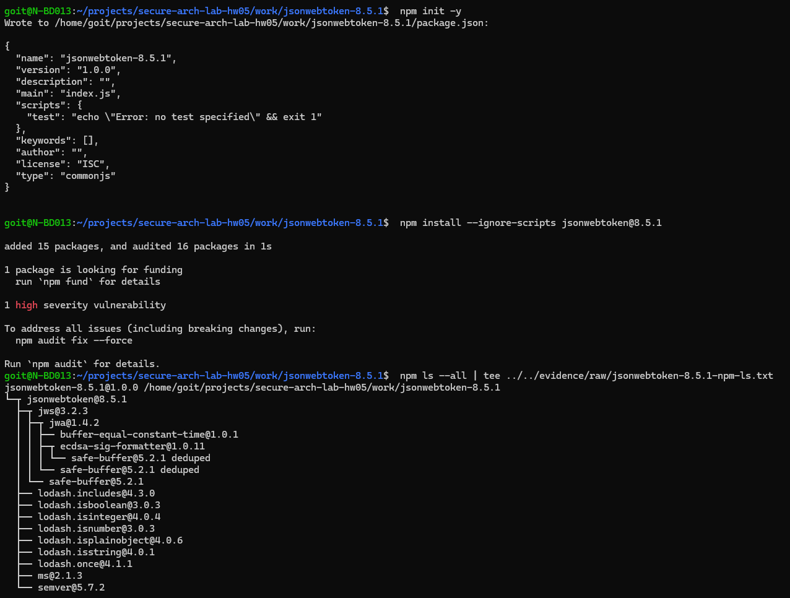

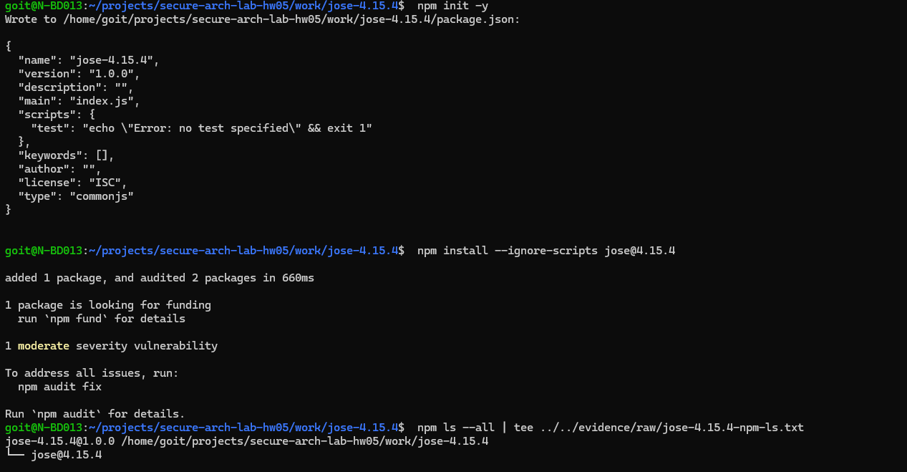

### 4.2 Socket.dev

На сторінці Socket.dev для `jsonwebtoken@8.5.1` видно CVE-попередження та попередження, пов'язане із залежностями. Це узгоджується з тим, що пакет має складніше дерево залежностей і кілька відомих повідомлень про вразливості.

На сторінці Socket.dev для `jose@4.15.4` також є ризикові сигнали, зокрема попередження про CVE середнього рівня та попередження про доступ до мережі. Водночас важлива різниця полягає в тому, що `jose` не тягне додаткові npm-залежності.

Використані сторінки:

- [Socket.dev: jsonwebtoken](https://socket.dev/npm/package/jsonwebtoken)
- [Socket.dev: jose](https://socket.dev/npm/package/jose)

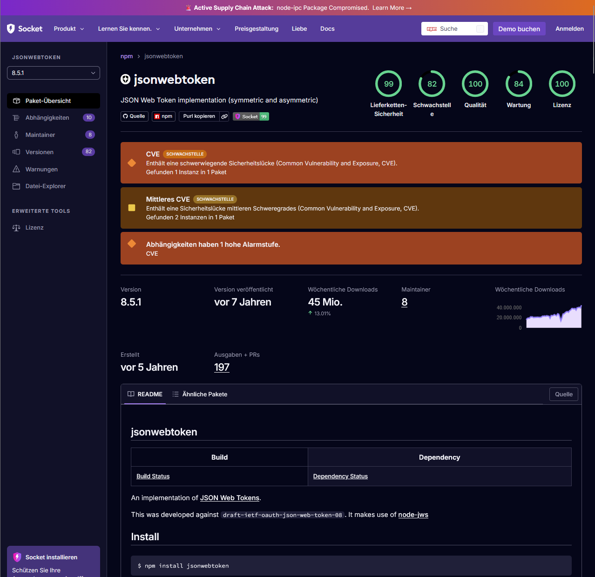

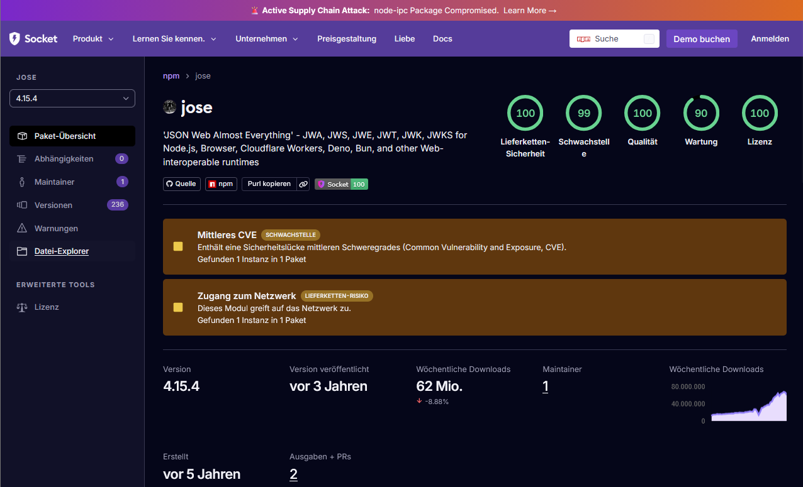

### 4.3 deps.dev

deps.dev підтвердив суттєву різницю в поверхні ризику через залежності. Для `jsonwebtoken@8.5.1` видно прямі та непрямі залежності, а також повідомлення про вразливості. Для `jose@4.15.4` сторінка показує відсутність залежностей і одне повідомлення про вразливість.

З практичного погляду це важливо: навіть якщо у двох пакетів є CVE, пакет із меншим деревом залежностей простіше контролювати в реальному проєкті. Менше сторонніх компонентів означає менше оновлень, менше можливих проблем у ланцюгу постачання ПЗ і простіший аудит.

Використані сторінки:

- [deps.dev: jsonwebtoken 8.5.1](https://deps.dev/npm/jsonwebtoken/8.5.1)
- [deps.dev: jose 4.15.4](https://deps.dev/npm/jose/4.15.4)

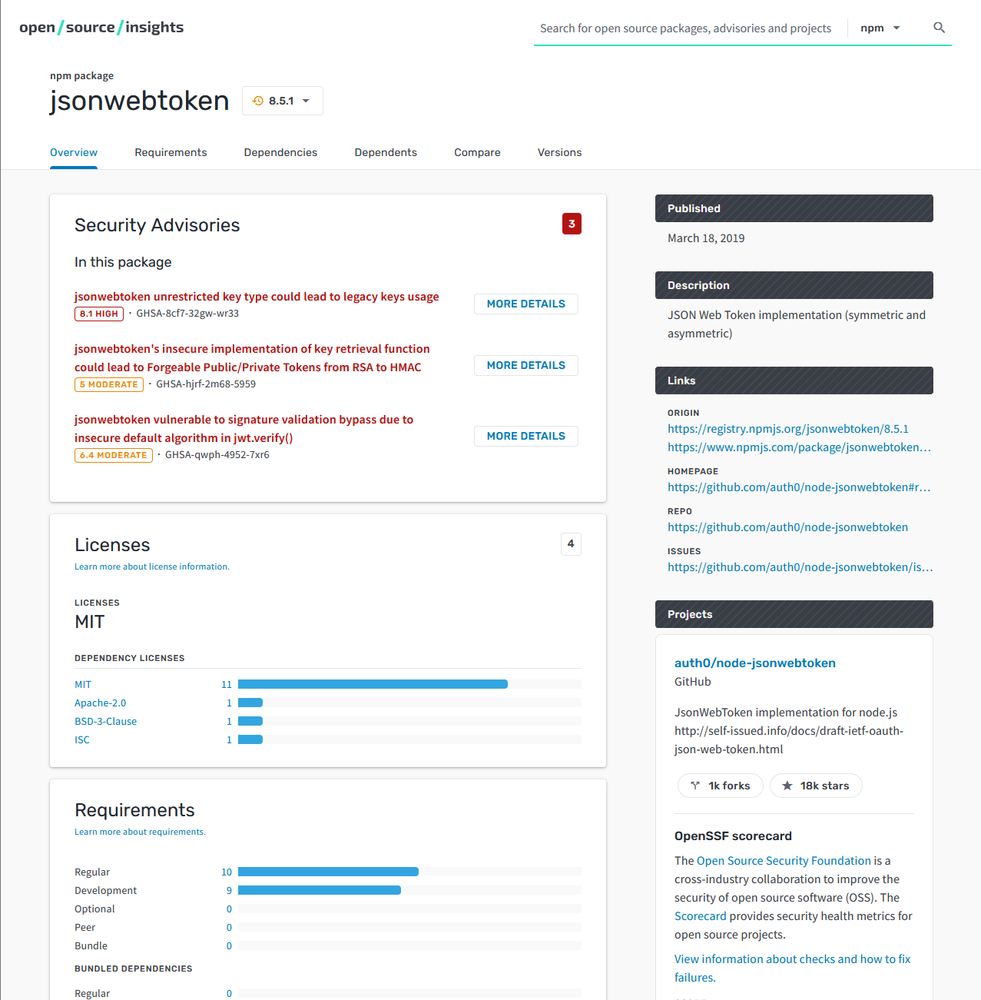

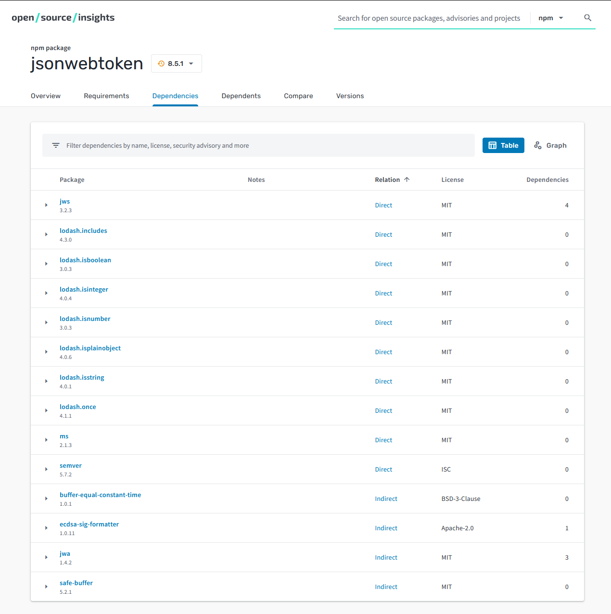

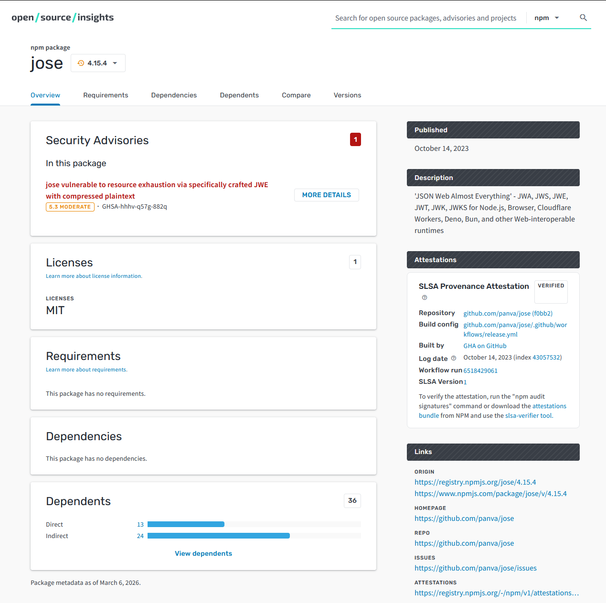

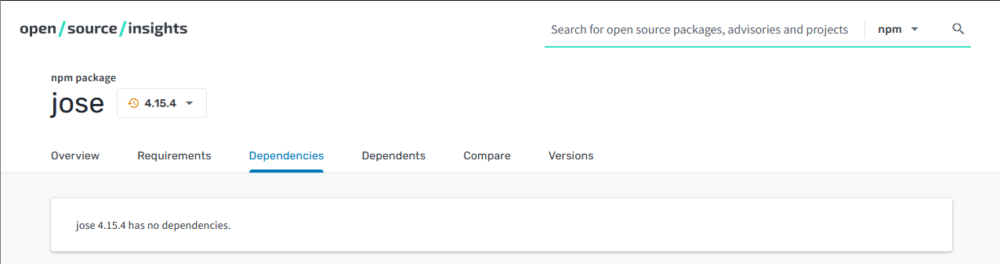

### 4.4 OpenSSF Scorecard

OpenSSF Scorecard показав такі загальні оцінки:

- `jsonwebtoken` / `auth0/node-jsonwebtoken`: 5.6;
- `jose` / `panva/jose`: 7.2.

Це не означає, що `jose` автоматично безпечний у будь-якому сценарії, але показує кращу загальну гігієну репозиторію за перевірками Scorecard. Для вибору залежності це додатковий аргумент на користь `jose`, особливо якщо проєкт має суворі вимоги до підтримки й безпеки залежностей.

Використані сторінки:

- [OpenSSF Scorecard: auth0/node-jsonwebtoken](https://scorecard.dev/viewer/?uri=github.com/auth0/node-jsonwebtoken)
- [OpenSSF Scorecard: panva/jose](https://scorecard.dev/viewer/?uri=github.com/panva/jose)

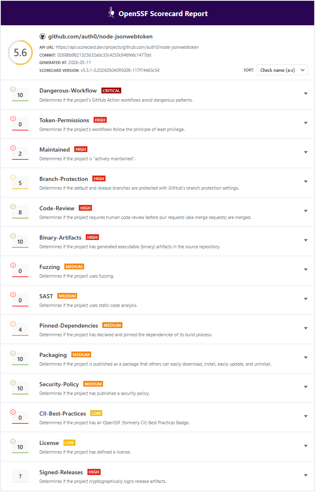

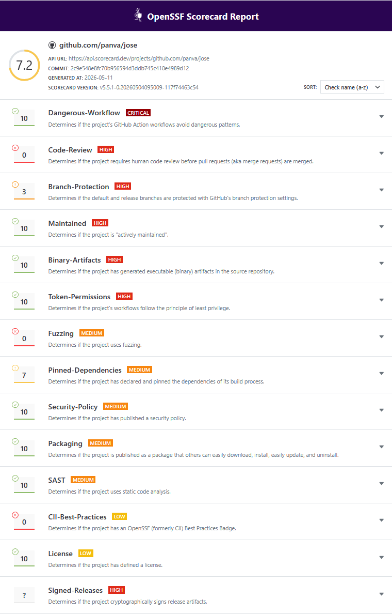

### 4.5 SBOM через Syft

Syft було використано для створення SBOM у форматі CycloneDX JSON.

Для `jsonwebtoken@8.5.1` Syft table output містить 16 npm-компонентів, включно з локальним root-проєктом і самим пакетом `jsonwebtoken`. У CycloneDX JSON додатково присутній компонент `package-lock.json`, тому загальна кількість компонентів у JSON - 17.

Для `jose@4.15.4` Syft table output містить 2 npm-компоненти: локальний root-проєкт і сам пакет `jose`. У CycloneDX JSON також є `package-lock.json`, тому загальна кількість компонентів у JSON - 3.

Ключовий фрагмент Syft table output:

```text
jsonwebtoken: 16 npm-компонентів
jose: 2 npm-компоненти
```

Це підтверджує головну різницю між пакетами: `jsonwebtoken` має помітно більшу кількість компонентів у SBOM, а `jose` майже не розширює дерево залежностей.

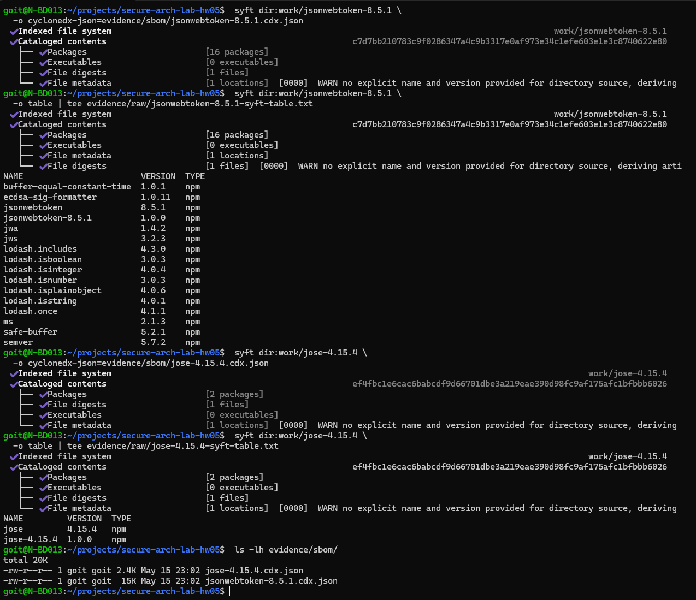

Файли SBOM:

- [SBOM jsonwebtoken](https://github.com/andriy-pro/secure-arch-lab-hw05/blob/main/evidence/sbom/jsonwebtoken-8.5.1.cdx.json)
- [SBOM jose](https://github.com/andriy-pro/secure-arch-lab-hw05/blob/main/evidence/sbom/jose-4.15.4.cdx.json)

### 4.6 Сканування SBOM через Grype

Grype знайшов для `jsonwebtoken@8.5.1` три повідомлення про вразливості:

| Advisory | Severity | Виправлено у версії | EPSS за Grype |
|---|---|---:|---:|
| GHSA-8cf7-32gw-wr33 | High | 9.0.0 | < 0.1% |
| GHSA-hjrf-2m68-5959 | Medium | 9.0.0 | < 0.1% |
| GHSA-qwph-4952-7xr6 | Medium | 9.0.0 | < 0.1% |

Для `jose@4.15.4` Grype знайшов одне повідомлення:

| Advisory | Severity | Виправлено у версії | EPSS за Grype |
|---|---|---:|---:|
| GHSA-hhhv-q57g-882q | Medium | 4.15.5 | 0.6% |

Для `jose` Grype округлює EPSS до `0.6%`; у JSON FIRST API для цієї CVE зафіксовано `0.572%`.

Ключовий фрагмент результату:

```text
jsonwebtoken  8.5.1  9.0.0   GHSA-8cf7-32gw-wr33  High
jsonwebtoken  8.5.1  9.0.0   GHSA-hjrf-2m68-5959  Medium
jsonwebtoken  8.5.1  9.0.0   GHSA-qwph-4952-7xr6  Medium
jose          4.15.4 4.15.5  GHSA-hhhv-q57g-882q  Medium
```

Обидва пакети мають доступні виправлені версії. Для `jsonwebtoken` рекомендоване оновлення до `9.0.0`, для `jose` - щонайменше до `4.15.5`.

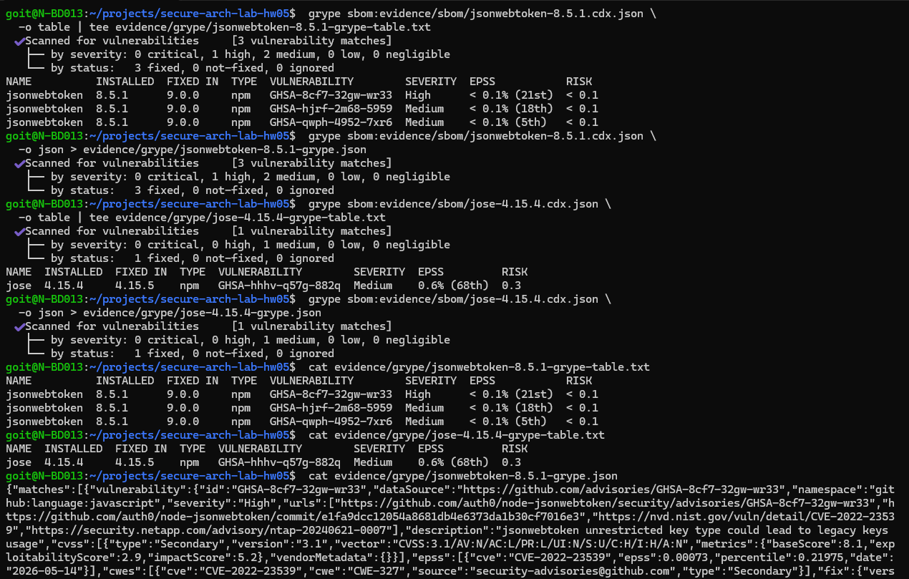

Файли результатів Grype:

- [Grype table: jsonwebtoken](https://github.com/andriy-pro/secure-arch-lab-hw05/blob/main/evidence/grype/jsonwebtoken-8.5.1-grype-table.txt)
- [Grype JSON: jsonwebtoken](https://github.com/andriy-pro/secure-arch-lab-hw05/blob/main/evidence/grype/jsonwebtoken-8.5.1-grype.json)
- [Grype table: jose](https://github.com/andriy-pro/secure-arch-lab-hw05/blob/main/evidence/grype/jose-4.15.4-grype-table.txt)
- [Grype JSON: jose](https://github.com/andriy-pro/secure-arch-lab-hw05/blob/main/evidence/grype/jose-4.15.4-grype.json)

### 4.7 Ручна перевірка CVE та EPSS

Для `jsonwebtoken@8.5.1` вручну перевірено:

- `CVE-2022-23539` - NVD CVSS 8.1, EPSS 0.073%;
- `CVE-2022-23540` - NVD CVSS 7.6, EPSS 0.020%;
- `CVE-2022-23541` - NVD CVSS 6.3, EPSS 0.060%.

Середня NVD CVSS для цих CVE: приблизно 7.3. Найвища EPSS серед них: 0.073%.

Для `jose@4.15.4` вручну перевірено:

- `CVE-2024-28176` - NVD CVSS 5.9, EPSS 0.572%.

Тут є важливий нюанс: у `jsonwebtoken` CVSS вищий і CVE більше, але EPSS у виявленої CVE для `jose` вищий. Це показує, що рішення не можна будувати тільки за одним числом. Для практичного вибору потрібно одночасно дивитися на CVSS, EPSS, кількість CVE, дерево залежностей, підтримку й наявність виправленої версії.

Використані сторінки:

- [NVD: CVE-2022-23539](https://nvd.nist.gov/vuln/detail/CVE-2022-23539)
- [NVD: CVE-2022-23540](https://nvd.nist.gov/vuln/detail/CVE-2022-23540)
- [NVD: CVE-2022-23541](https://nvd.nist.gov/vuln/detail/CVE-2022-23541)
- [NVD: CVE-2024-28176](https://nvd.nist.gov/vuln/detail/CVE-2024-28176)
- [EPSS API: CVE-2022-23539](https://api.first.org/data/v1/epss?cve=CVE-2022-23539)
- [EPSS API: CVE-2022-23540](https://api.first.org/data/v1/epss?cve=CVE-2022-23540)
- [EPSS API: CVE-2022-23541](https://api.first.org/data/v1/epss?cve=CVE-2022-23541)
- [EPSS API: CVE-2024-28176](https://api.first.org/data/v1/epss?cve=CVE-2024-28176)

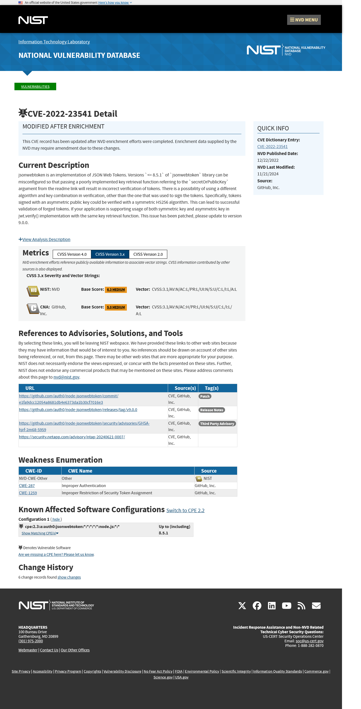

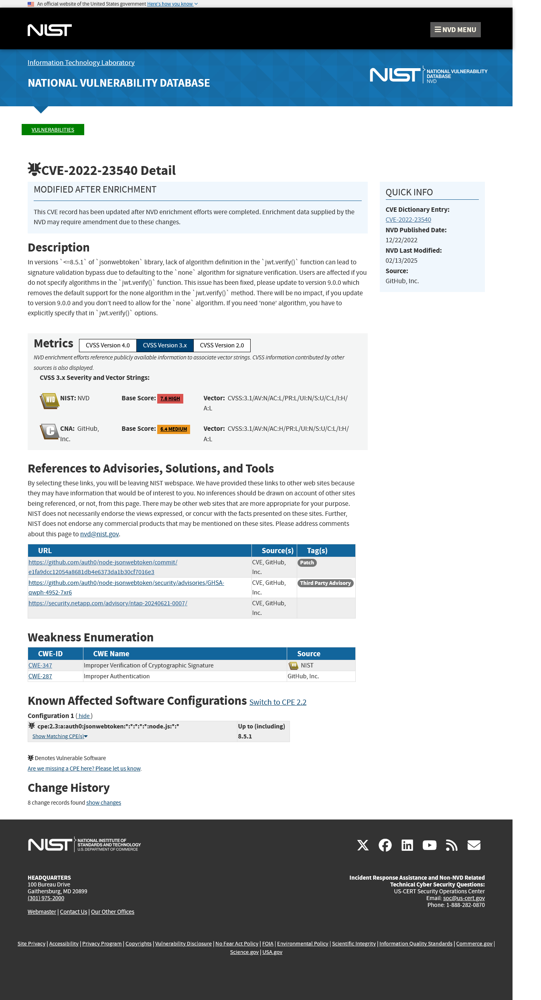

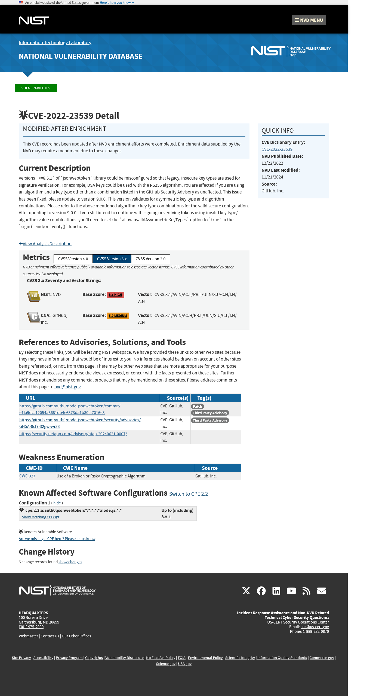

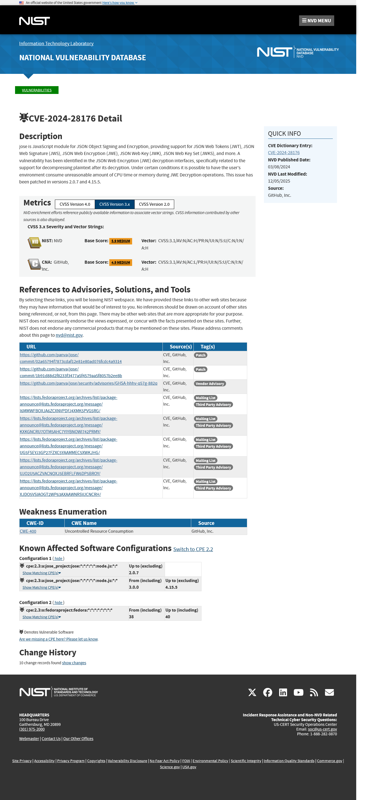

Файли EPSS:

- [EPSS CVE-2022-23539](https://github.com/andriy-pro/secure-arch-lab-hw05/blob/main/evidence/raw/epss-CVE-2022-23539.json)
- [EPSS CVE-2022-23540](https://github.com/andriy-pro/secure-arch-lab-hw05/blob/main/evidence/raw/epss-CVE-2022-23540.json)
- [EPSS CVE-2022-23541](https://github.com/andriy-pro/secure-arch-lab-hw05/blob/main/evidence/raw/epss-CVE-2022-23541.json)
- [EPSS CVE-2024-28176](https://github.com/andriy-pro/secure-arch-lab-hw05/blob/main/evidence/raw/epss-CVE-2024-28176.json)

---

## 5. Порівняльна таблиця

| Критерій | `jsonwebtoken@8.5.1` | `jose@4.15.4` |
|---|---|---|
| Функціональна область | JWT-пакет для підпису й перевірки токенів | JOSE/JWT/JWK/JWS/JWE-бібліотека |
| Ліцензія | MIT | MIT |
| Кількість прямих / транзитивних залежностей | 10 прямих і 4 унікальні транзитивні залежності за `npm ls`; 16 npm-компонентів у Syft table output | 0 прямих і 0 транзитивних залежностей; 2 npm-компоненти у Syft table output |
| Кількість CVE / повідомлень у Grype | 3 повідомлення | 1 повідомлення |
| Перевірені CVE вручну | `CVE-2022-23539`, `CVE-2022-23540`, `CVE-2022-23541` | `CVE-2024-28176` |
| Середня CVSS | приблизно 7.3 за NVD CVSS v3.1 | 5.9 за NVD CVSS v3.1 |
| Найвища EPSS | 0.073% (`CVE-2022-23539`) | 0.572% (`CVE-2024-28176`) |
| Рівень гігієни OpenSSF Scorecard | 5.6 | 7.2 |
| Ознаки ризику Socket.dev | CVE-попередження, попередження щодо залежностей, більша кількість залежностей | попередження про CVE середнього рівня, попередження про доступ до мережі, 0 залежностей |
| SBOM | CycloneDX JSON; 17 компонентів у JSON, з них 16 npm-компонентів у table output | CycloneDX JSON; 3 компоненти у JSON, з них 2 npm-компоненти у table output |
| Рекомендоване оновлення | до `9.0.0` | щонайменше до `4.15.5` |
| Загальна оцінка ризику | Вищий ризик через більшу кількість CVE, вищу середню CVSS і ширше дерево залежностей | Нижчий загальний ризик, але версію також потрібно оновити через CVE |

---

## 6. Висновки та рекомендації

За результатами аналізу безпечнішим вибором для нового проєкту виглядає `jose`, але не у версії `4.15.4`, а в оновленій версії, де виправлено `CVE-2024-28176`. Основні аргументи: нуль зовнішніх npm-залежностей, кращий бал OpenSSF Scorecard, менша кількість виявлених повідомлень про вразливості і менша середня CVSS.

`jsonwebtoken@8.5.1` не варто використовувати в новому проєкті без оновлення. Grype показує три повідомлення про вразливості, а NVD CVSS для перевірених CVE дає середню оцінку приблизно 7.3. Крім того, пакет має більше залежностей, а отже й ширшу поверхню ризику через ланцюг постачання ПЗ. Якщо в існуючому проєкті вже використовується `jsonwebtoken@8.5.1`, перший крок - оновити його до `9.0.0` і перевірити сумісність тестами.

Для CI/CD я б запропонував такі політики:

1. Автоматично створювати SBOM через Syft для кожної релізної збірки.
2. Запускати Grype або аналогічний SCA-сканер у конвеєрі CI/CD.
3. Блокувати збірку для залежностей із High/Critical severity, якщо є доступна версія з виправленням.
4. Для знахідок середнього рівня не блокувати збірку автоматично, але створювати задачу з дедлайном виправлення.
5. Окремо враховувати EPSS: якщо ймовірність експлуатації зростає або CVE активно експлуатується, піднімати пріоритет навіть для Medium severity.
6. Періодично перевіряти OpenSSF Scorecard і Socket.dev для ключових залежностей, особливо тих, що працюють з автентифікацією, токенами або криптографічними операціями.

Підсумкове рішення: для нового коду доцільніше використовувати оновлений `jose`, а `jsonwebtoken@8.5.1` розглядати як залежність, яку потрібно оновити або поступово замінити. Якщо ж у проєкті вже є велика кодова база на `jsonwebtoken`, заміна має бути контрольованою: через оновлення, тестування токенів, перевірку сумісності алгоритмів і поступову міграцію.

---

## 7. Матеріали в репозиторії

- [Опис зібраних скриншотів](https://github.com/andriy-pro/secure-arch-lab-hw05/blob/main/evidence/notes/evidence-inventory.md)
- [npm ls: jsonwebtoken](https://github.com/andriy-pro/secure-arch-lab-hw05/blob/main/evidence/raw/jsonwebtoken-8.5.1-npm-ls.txt)
- [npm ls: jose](https://github.com/andriy-pro/secure-arch-lab-hw05/blob/main/evidence/raw/jose-4.15.4-npm-ls.txt)
- [Syft table: jsonwebtoken](https://github.com/andriy-pro/secure-arch-lab-hw05/blob/main/evidence/raw/jsonwebtoken-8.5.1-syft-table.txt)
- [Syft table: jose](https://github.com/andriy-pro/secure-arch-lab-hw05/blob/main/evidence/raw/jose-4.15.4-syft-table.txt)
